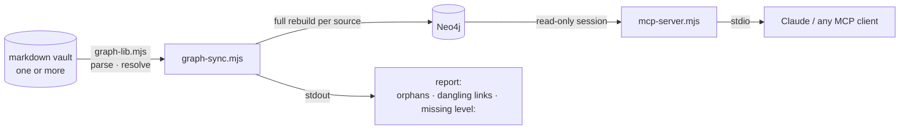

# brain-graph

A Neo4j index over a folder of markdown notes linked with `[[wikilinks]]` (an Obsidian
vault, a team wiki, an AI agent's memory), plus a read-only MCP server so Claude or any other
MCP client can query it.

Grep answers "which files mention Acme". This answers "what is connected to Acme, and how
far", and lists the orphans and dangling links in the vault on every sync.



## Quickstart

Needs Node 20.6+ and Docker.

```bash
npm install
npm run verify        # 26 assertions against the bundled example-vault/
npm run dry           # parse example-vault/ and print the report. No database needed.
```

```
sources      : brain
nodes        : 12  (8 governed by the orphan/level rules)
edges        : 12
orphans      : 1  (12.5% of governed)
dangling     : 1  (wikilinks pointing at nothing)
...
DANGLING WIKILINKS (target does not exist — fix the link or write the note):
  brain:ideas/someday  ->  [[ideas/not-written-yet]]
```

Then point it at your own vault and write the graph:

```bash
cp .env.example .env            # set NEO4J_PASSWORD and GRAPH_SOURCES
npm run up                      # Neo4j 5 + APOC, browser UI on http://localhost:7474
npm run sync
```

> **Sync is a full rebuild.** It deletes every node whose `source` matches a name in
> `GRAPH_SOURCES` and writes them again. Don't share a source name with anything else
> living in the same database.

## Connect Claude

Add the server to `.mcp.json` (Claude Code) or your client's MCP config:

```json
{
  "mcpServers": {
    "brain-graph": {
      "command": "node",
      "args": ["/path/to/brain-graph/mcp-server.mjs"]
    }
  }
}
```

It reads `NEO4J_PASSWORD` from the environment or from the `.env` beside it.

| Tool | What it answers |
|---|---|
| `entity_neighbors` | Everything within 1–3 hops of a note |
| `shortest_path` | How two notes relate, as a chain of slugs |
| `find_orphans` | Notes with no links in or out |
| `recent_by_type` | Most recently updated notes with a given label |
| `graph_stats` | Counts by label and edge type, orphans, notes missing `level:` |
| `query_graph` | Any read-only Cypher |

Every Cypher statement is checked for write clauses before it reaches the driver, and the
session is opened in read mode.

## What becomes a node and an edge

- **Nodes.** Every `.md` file, keyed by its path without the extension (`builds/example-app`).
  Its label comes from frontmatter `type:`, or failing that from its top folder
  (`people/` → `Person`, `companies/` → `Company`; the table is `FOLDER_TYPE` in
  `graph-lib.mjs`). `INDEX.md` files are labelled `Index`. Scripts (`.sh`, `.mjs`, `.ps1`)
  under `systems/` or `scripts/` become nodes too, so links to them resolve.
- **`LINKS_TO` edges.** Every `[[wikilink]]` in a note's body. Links inside code spans,
  fenced blocks and HTML comments are ignored, so a note that documents the link syntax
  doesn't link to a note called "wikilink".
- **Typed edges.** `company:` → `WORKS_AT`, `client:` → `FOR_CLIENT`, `supersedes:` →
  `SUPERSEDES`, `uses_skill:` → `USES_SKILL`. A field only becomes an edge when its value
  is written as a wikilink (`company: "[[companies/acme]]"`). `client: internal` stays
  plain text.
- **Resolution.** For each link the resolver tries, in order: the exact slug, a
  case-insensitive match, an alias declared on the target (`aliases:`, `alias:` or `slug:`),
  the folder's `README`, `INDEX` or `SKILL`, then a basename that matches exactly one note. When two
  notes match, it reports the link as dangling rather than guessing, because a wrong edge
  is worse than a reported one.
- **Exempt from the rules.** `skills/**`, anything with a `_`-prefixed path segment, and the
  slugs in `GRAPH_GENERATED` are indexed but never reported as orphans or as missing
  `level:`. Dot-folders aren't read. `archive/agent-outputs/` and `backups/` are indexed
  as single nodes, and their contents are never parsed.

Each vault in `GRAPH_SOURCES` is resolved on its own. A link in one vault never resolves to
a note in another.

## Design notes

- **The markdown is the source of truth.** The graph is derived from it and rebuilt from
  scratch on every sync. If the graph and the files disagree, the fix is to run the sync
  again, never to edit the graph, which is why the MCP server can't write.
- **No YAML dependency.** The frontmatter reader handles flat `key: value` and lists, which
  covers how notes actually get written. One fewer native install to break.
- **CRLF is tested.** In JavaScript, `$` won't match before a `\r`. A regex-based
  frontmatter parser returned nothing for every CRLF file and reported no error, so a vault
  checked out on Windows gave different answers than on Linux. `verify.mjs` checks that
  both line endings parse identically, and `.gitattributes` keeps the CRLF fixture CRLF.

## License

MIT. Built by [Dime Data](https://dimedata.cloud).
